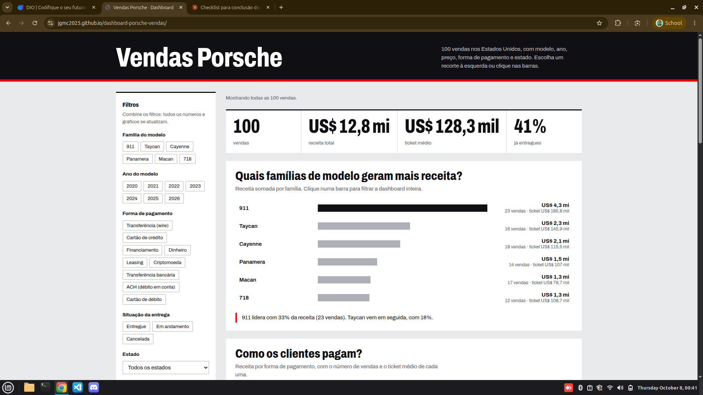
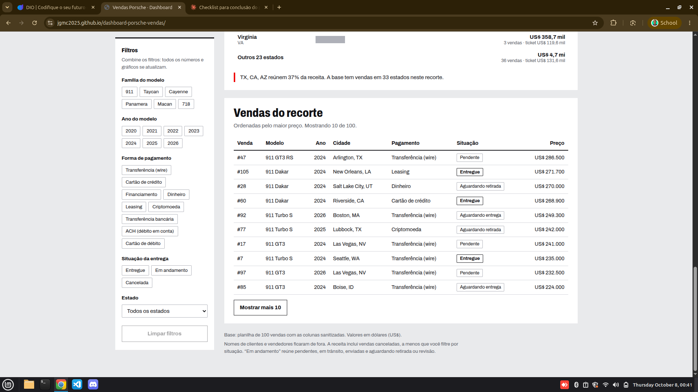

# 🏁 Dashboard de Vendas Porsche

Dashboard interativa em **HTML de arquivo único** que responde perguntas de negócio sobre 100 vendas de Porsche nos Estados Unidos, com filtros, indicadores de topo e gráficos que também funcionam como filtro (clique na barra).

🔗 **Dashboard publicada:** https://jgmc2025.github.io/dashboard-porsche-vendas/

📦 **Repositório:** https://github.com/Jgmc2025/dashboard-porsche-vendas



## ❓ Perguntas de negócio e por que as escolhi

| # | Pergunta | Resposta na dashboard | Por que importa |
|---|---|---|---|
| 1 | **Quais famílias de modelo geram mais receita?** | Barras de receita por família (911, Cayenne, Macan, Taycan, Panamera, 718) | Mostra onde está o dinheiro do portfólio. A família 911 lidera com 33% da receita, e Taycan vem em seguida com 18%. |
| 2 | **Como os clientes pagam?** | Barras de receita por forma de pagamento, com nº de vendas e ticket médio | Em carros de alto valor, a forma de pagamento muda o risco e a operação. Transferência (wire) concentra 31% da receita, mas o maior ticket médio é de criptomoeda. |
| 3 | **Em quais estados estão as vendas?** | Ranking dos 10 estados com mais receita | Indica onde concentrar estoque e equipe. TX, CA e AZ reúnem 37% da receita. |

Escolhi poucas perguntas de propósito: cada gráfico responde uma delas, tem um texto que lê o resultado e se recalcula com os filtros. Não incluí uma pergunta sobre evolução no tempo porque 24 das 100 datas ficaram `INVALID` na sanitização, então o resultado seria enganoso.

**Indicadores de topo:** vendas, receita total, ticket médio e % já entregue.
**Filtros:** família do modelo, ano do modelo, forma de pagamento, situação da entrega e estado. Eles se combinam entre si.

### Exemplo de filtro aplicado
Família **Cayenne** + ano do modelo **2024**: 4 vendas, US$ 507,7 mil de receita, ticket médio de US$ 126,9 mil e 25% já entregues.



## 🧹 Tratamento da base antes de ir para a IA
Base de partida: planilha com 100 vendas, cada campo em duas versões (cru e sanitizado).

1. **Só as colunas sanitizadas** foram usadas (`PorscheModelSanitized`, `ModelYearSanitized`, `SalesPriceSanitized`, `VehicleMileageSanitized`, `PayMethodSanitized`, `CitySanitized`, `StateSanitized`, `DeliveryStatusSanitized`, `SaleDateSanitized`).
2. **Preço e ano como número**, sem fórmulas: tudo virou valor (preço em US$, ano como inteiro).
3. **Dados pessoais removidos:** `customer_name` e `salesperson` não entram no arquivo, porque a base fica embutida no HTML.
4. **Datas inválidas:** 24 registros têm `INVALID` em `SaleDateSanitized`. No CSV tratado a data permanece `INVALID`; no HTML ela vira `null`. Nenhuma pergunta depende de data. As datas válidas vêm da planilha original e não foram alteradas nem usadas na dashboard.
5. **Colunas derivadas:**
   - `model_family`: primeiro termo do modelo (911, 718, Cayenne, Macan, Panamera, Taycan). Os 40 modelos foram classificados sem sobra.
   - `status_group`: Entregue (41), Cancelada (7) e Em andamento (52), que reúne Pending, In Transit, Shipped, Awaiting Pickup e outros.
6. **Conferência:** soma de preços de US$ 12.827.800,50 e 100 `sale_id` únicos. Os totais da dashboard foram comparados com o pandas, inclusive com filtros combinados.

O resultado está em [`dados/porsche_vendas_tratado.csv`](dados/porsche_vendas_tratado.csv).

## 🤖 Ferramenta usada
Usei o **Claude (Anthropic)**, um assistente com ambiente de código e navegador de teste. **Não** usei ChatGPT com Canvas nem um agente com skill própria. A dashboard foi gerada em HTML/CSS/JS puro, sem bibliotecas externas (só a fonte Archivo, do Google Fonts, com fallback para Arial). Os gráficos são barras em HTML, e o teste foi feito em um Chromium automatizado.

## ✍️ Prompt e o que mudou até a versão final

**Prompt (versão final, resumida):**
> Com a planilha de 100 vendas Porsche (colunas sanitizadas), crie uma dashboard em HTML de arquivo único. Responda três perguntas: (1) quais famílias de modelo geram mais receita, (2) como os clientes pagam, (3) em quais estados estão as vendas. Inclua KPIs de topo (vendas, receita, ticket médio, % entregue) e filtros por família, ano do modelo, pagamento, situação da entrega e estado. Cada gráfico deve funcionar como filtro ao clicar. Escreva uma frase de leitura sob cada gráfico. Visual sóbrio, em preto, cinza e vermelho, com uma tipografia condensada nos números. Não inclua nomes de clientes.

**O que mudou durante a construção (problemas encontrados no teste):**
- As barras dos gráficos não apareciam, porque eram elementos `inline` e a largura era ignorada. Passaram a `display:block`.
- A linha "Outros 23 estados" somava mais que qualquer estado e distorcia a escala. Ela agora mostra só o valor, sem barra.
- No celular, os indicadores estouravam a largura da tela. Ajustei a grade e o tamanho dos números.
- Os status de entrega apareciam em inglês (Pending, In Transit). Traduzi para o português.

## 📁 Arquivos
```
/
├── index.html                      # dashboard (arquivo único, base embutida)
├── README.md
├── dados/porsche_vendas_tratado.csv
└── imagens/
    ├── dashboard_geral.png
    └── dashboard_filtro_cayenne.png
```

## 💡 Ideias para evoluir
- Escrever uma segunda regra de sanitização para recuperar as 24 datas `INVALID` e adicionar uma pergunta sobre evolução mensal.
- Trocar o ranking de estados por um mapa.
- Criar uma versão no estilo dos componentes do Power BI.
